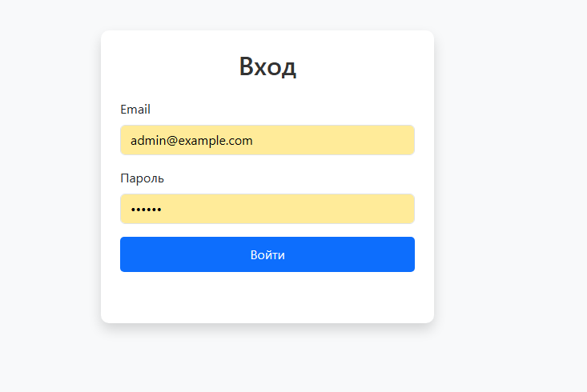
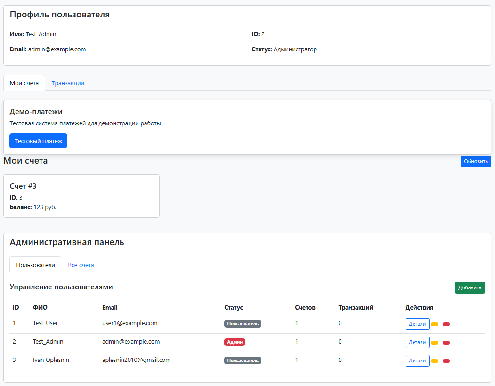
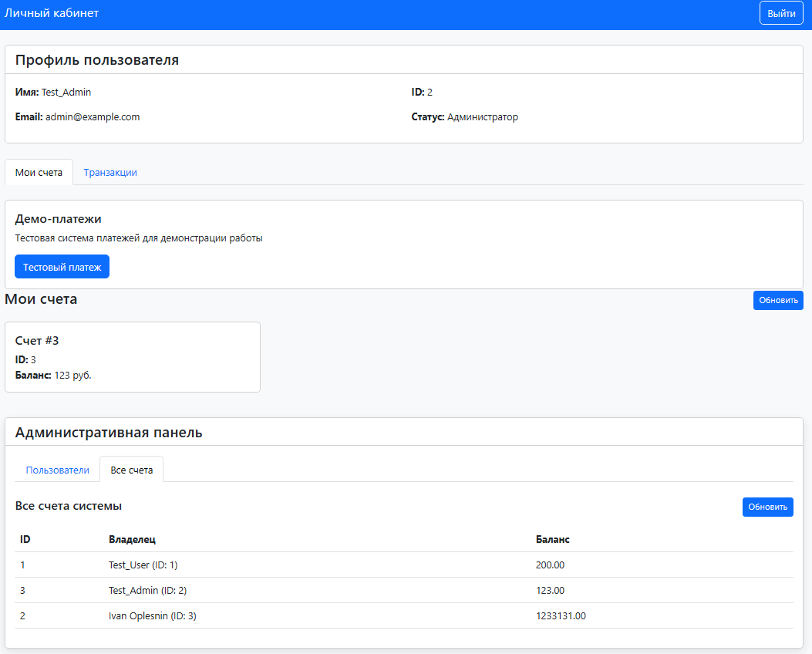
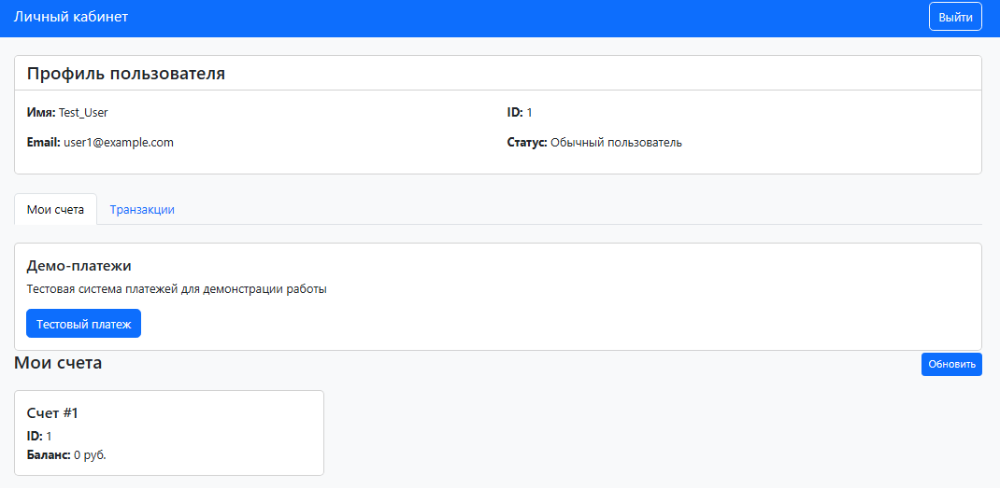
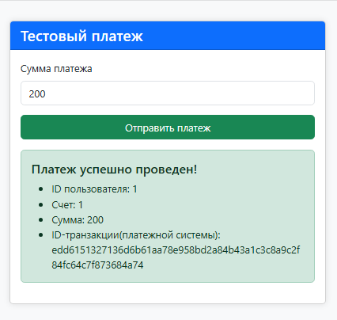

# FastAPI Backend + Frontend + PostgreSQL

Это полнофункциональное веб-приложение с **FastAPI** (бэкенд), **PostgreSQL** (БД) и фронтендом, эмулирующим работу
платежной системы. Проект запускается через Docker Compose.

## Пару слов о проекте.

Проект является демонстрационным, поэтому в данном проекте все переменные окружения и секретные ключи находятся
в репозитории, при коммерческой разработке эти данные не должны быть в открытом репозитории.

## Состав проекта

- **test_web/** – код FastAPI приложения.
- **frontend/** – фронтенд для взаимодействия с API и эмуляции платежной системы.
- **docker-compose.yaml** – файл для запуска всех сервисов.
- **README.md** – инструкция по установке и использованию.

## Стек технологий

- **Backend**: FastAPI + SQLAlchemy (async) + Alembic + JWT
- **Database**: PostgreSQL (13.2-alpine)
- **Frontend**: HTML, CSS, JS
- **Docker** и Docker Compose для сборки и запуска

---

## Быстрый старт

### Установка зависимостей

Перед запуском убедитесь, что установлены:

- Docker
- Docker Compose

### Запуск проекта

Запустите все сервисы одной командой:

```bash
docker-compose up --build
```

При первом запуске нужно запустить первую миграцию, для добавления в базу данных двух пользователей

```bash
docker-compose exec backend alembic upgrade head
```

Это создаст и запустит следующие сервисы:

| Сервис   | Назначение                            | URL                                            |
|----------|---------------------------------------|------------------------------------------------|
| backend  | FastAPI сервер (API)                  | [http://localhost:8000](http://localhost:8000) |
| database | PostgreSQL база данных                | localhost:5433                                 |
| frontend | Эмуляция платежной системы и фронтенд | [http://localhost:3000](http://localhost:3000) |

Доступные аккаунты
При старте создаются тестовые пользователи:

Пользователь:
\
email: user1@example.com
\
password: 123456

Администратор:
\
email: admin@example.com
\
password: qwerty

### Переменные окружения

Прописаны внутри docker-compose.yaml:

| Переменная   | Описание                                      |
|--------------|-----------------------------------------------|
| PG\_LINK     | Строка подключения к БД для FastAPI           |
| SECRET\_KEY  | Секретный ключ для подписи JWT                |
| PAYMENT\_KEY | Секретный ключ для генерации сигнатур вебхука |

## Основные эндпоинты
## Документация Swagger доступна по адресу:
http://localhost:8000/docs

### Пользовательские эндпоинты

| Метод | Эндпоинт              | Описание                                |
|-------|-----------------------|-----------------------------------------|
| POST  | `/login/`             | Авторизация (возвращает JWT токен)      |
| GET   | `/users/info`         | Информация о текущем пользователе       |
| GET   | `/users/accounts`     | Список счетов текущего пользователя     |
| GET   | `/users/transactions` | Список транзакций текущего пользователя |

### Администраторские эндпоинты

| Метод  | Эндпоинт                       | Описание                               |
|--------|--------------------------------|----------------------------------------|
| GET    | `/admin/all_users`             | Получить всех пользователей + их счета |
| POST   | `/admin/create_user`           | Создать нового пользователя            |
| PUT    | `/admin/update_user/{user_id}` | Обновить пользователя                  |
| DELETE | `/admin/delete_user/{user_id}` | Удалить пользователя                   |

### Эмуляция вебхука

| Метод | Эндпоинт           | Описание                     |
|-------|--------------------|------------------------------|
| POST  | `/payment_webhook` | Обработка платежного вебхука |

## Примечания
- JWT токен нужно вставлять в заголовок Authorization в формате:

```php-template
Bearer <ваш_токен>
```
- Если Swagger UI не показывает поле для токена, используйте заголовок вручную или переключитесь на HTTPBearer схему (что уже сделано).

❗ Примечания
JWT токен нужно вставлять в заголовок Authorization в формате:

## Скриншоты фронтенда.
# Страница авторизации (http://localhost:3000/login.html)


# Страница админа. (http://localhost:3000/profile.html)
 

# Страница пользователя. (http://localhost:3000/profile.html)


# Страница эмулирующая работу платежной системы (http://localhost:3000/webhook.html)


## Автор
- Иван ( https://t.me/i_vanya0956 ) telegram
- https://github.com/IvanOplesnin GitHub

DockerHub: https://hub.docker.com/u/ivanya0956

